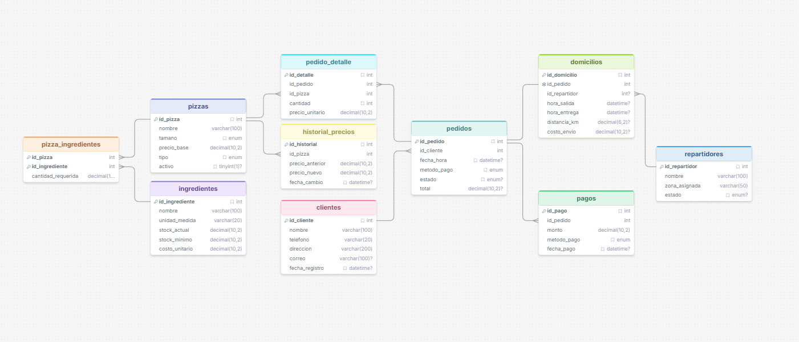

# Pizzería Don Piccolo — Sistema de Gestión de Pedidos y Domicilios

## 1. Descripción del proyecto

Pizzería Don Piccolo maneja actualmente sus pedidos de forma manual, lo que genera
retrasos en la atención y errores en los registros de clientes y entregas. Este
proyecto diseña e implementa una **base de datos relacional en MySQL** que cubre
todo el ciclo del negocio: clientes, pizzas e ingredientes, pedidos, repartidores,
domicilios y pagos, incluyendo funciones, procedimientos, triggers y vistas que
automatizan cálculos y reglas de negocio, y consultas que responden a las
preguntas más frecuentes de la operación.

## 2. Estructura del proyecto

```
/pizzeria-don-piccolo/
 ├── tables/
 │    └── database.sql      -> Creación de la BD, tablas, llaves foráneas y datos de prueba
 ├── functions/
 │    └── functions.sql     -> Funciones y procedimientos almacenados
 ├── triggers/
 │    └── triggers.sql      -> Triggers de stock, auditoría y disponibilidad
 ├── views/
 │    └── views.sql         -> Vistas de reportes
 ├── queries/
 │    └── consults.sql      -> Consultas SQL de negocio (JOIN, GROUP BY, HAVING, etc.)
 ├── images/
 │    └── diagram.png       -> Diagrama completo de la base de datos
 ├── schema.sql             -> Script DDL limpio para importación en DrawSQL, Draw.io, etc.
 ├── diagram.dbml           -> Estructura en formato DBML para dbdiagram.io
 └── README.md              -> Este documento
```

## 3. Tablas y relaciones

| Tabla | Descripción | Relaciones |
|---|---|---|
| **clientes** | Nombre, teléfono, dirección, correo | 1 cliente → N pedidos |
| **pizzas** | Nombre, tamaño, precio base, tipo (vegetariana/especial/clásica) | 1 pizza → N pedido_detalle, N pizza_ingredientes |
| **ingredientes** | Nombre, unidad, stock actual, stock mínimo, costo unitario | 1 ingrediente → N pizza_ingredientes |
| **pizza_ingredientes** | Receta: qué ingredientes y cantidades lleva cada pizza | Tabla puente N:M entre `pizzas` e `ingredientes` |
| **repartidores** | Nombre, zona asignada, estado (disponible/no disponible) | 1 repartidor → N domicilios |
| **pedidos** | Cliente, fecha/hora, método de pago, estado, total | 1 pedido → N pedido_detalle, 1 pedido → 1 domicilio |
| **pedido_detalle** | Pizzas solicitadas en cada pedido (cantidad, precio unitario) | N:1 con `pedidos` y `pizzas` |
| **domicilios** | Hora de salida/entrega, distancia, costo de envío, repartidor | 1:1 con `pedidos`, N:1 con `repartidores` |
| **pagos** | Monto, método de pago, fecha de pago | N:1 con `pedidos` |
| **historial_precios** | Auditoría de cambios de precio de pizzas | N:1 con `pizzas`, poblada automáticamente por trigger |

**Diagrama de la base de datos:**



**Diagrama conceptual simplificado:**

```
clientes ──1:N── pedidos ──1:N── pedido_detalle ──N:1── pizzas ──N:M── ingredientes
                    │                                      │
                   1:1                                    N:1 (auditoría)
                    │                                      │
               domicilios                          historial_precios
                    │
                   N:1
                    │
              repartidores
```

## 4. Funciones y procedimientos

- **`fn_calcular_total_pedido(id_pedido)`**: suma el valor de las pizzas del
  pedido, agrega el costo de envío del domicilio asociado y aplica el 19% de IVA.
- **`fn_ganancia_neta_diaria(fecha)`**: calcula ventas de pedidos entregados en
  una fecha menos el costo de los ingredientes consumidos ese día.
- **`sp_marcar_pedido_entregado(id_pedido)`**: cambia el estado del pedido a
  `Entregado`. Es invocado automáticamente por el trigger `trg_pedido_entregado`.
- **`sp_registrar_entrega(id_domicilio)`**: procedimiento de apoyo para registrar
  la hora de entrega de un domicilio (dispara los triggers correspondientes).
- **`sp_registrar_salida(id_domicilio)`**: registra la hora de salida del
  repartidor para un domicilio, completando el ciclo salida → entrega.
  
## 5. Triggers

1. **`trg_actualizar_stock`**: al insertar un `pedido_detalle`, descuenta del
   stock de cada ingrediente la cantidad usada según la receta de la pizza.
2. **`trg_historial_precios`**: al actualizar el `precio_base` de una pizza,
   guarda el precio anterior y el nuevo en `historial_precios`.
3. **`trg_repartidor_ocupado`**: al crear un domicilio con repartidor asignado,
   lo marca como `No disponible`.
4. **`trg_pedido_entregado`**: al registrar `hora_entrega` en un domicilio,
   marca al repartidor como `Disponible` de nuevo y llama a
   `sp_marcar_pedido_entregado` para cerrar el pedido.
5. **`trg_actualizar_total_detalle`**: recalcula `pedidos.total` automáticamente
   cada vez que se agrega una pizza al pedido.
6. **`trg_actualizar_total_envio`**: recalcula `pedidos.total` cuando se
   registra o modifica el costo de envío del domicilio.

## 6. Vistas

- **`vista_resumen_pedidos_cliente`**: nombre del cliente, cantidad de pedidos
  y total gastado.
- **`vista_desempeno_repartidores`**: número de entregas, tiempo promedio de
  entrega (minutos) y zona por repartidor.
- **`vista_stock_bajo`**: ingredientes cuyo stock actual está por debajo del
  mínimo permitido.

## 7. Ejemplos de consultas (ver `consultas.sql`)

```sql
-- Pizzas más vendidas
SELECT pz.nombre, SUM(pd.cantidad) AS unidades_vendidas
FROM pedido_detalle pd
JOIN pizzas pz ON pz.id_pizza = pd.id_pizza
GROUP BY pz.id_pizza, pz.nombre
ORDER BY unidades_vendidas DESC;

-- Clientes frecuentes (más de 5 pedidos en el mes actual)
SELECT c.id_cliente, c.nombre
FROM clientes c
WHERE c.id_cliente IN (
    SELECT p.id_cliente FROM pedidos p
    WHERE YEAR(p.fecha_hora) = YEAR(CURDATE())
      AND MONTH(p.fecha_hora) = MONTH(CURDATE())
    GROUP BY p.id_cliente
    HAVING COUNT(*) > 5
);
```

Uso de las funciones y vistas:

```sql
-- Calcular y guardar el total de un pedido
UPDATE pedidos SET total = fn_calcular_total_pedido(1) WHERE id_pedido = 1;

-- Ganancia neta de hoy
SELECT fn_ganancia_neta_diaria(CURDATE());

-- Reportes
SELECT * FROM vista_resumen_pedidos_cliente;
SELECT * FROM vista_desempeno_repartidores;
SELECT * FROM vista_stock_bajo;

-- Registrar la entrega de un domicilio (dispara los triggers)
CALL sp_registrar_entrega(1);
```

## 8. Instrucciones para ejecutar el script

Requisitos: MySQL 8.0+ (o MariaDB 10.3+) y un cliente como `mysql` CLI,
MySQL Workbench o similar.

**Opción A — desde la línea de comandos**, ejecutar los archivos en este orden
(el orden es importante porque los triggers dependen de las funciones y
procedimientos, y las tablas deben existir antes de todo lo demás):

```bash
mysql -u usuario -p < tables/database.sql
mysql -u usuario -p < functions/functions.sql
mysql -u usuario -p < triggers/triggers.sql
mysql -u usuario -p < views/views.sql
mysql -u usuario -p pizzeria_don_piccolo < queries/consults.sql
```

**Opción B — desde MySQL Workbench**: abrir cada archivo en una pestaña de
consulta y ejecutarlo (⚡ Execute) siguiendo el mismo orden:
`tables/database.sql → functions/functions.sql → triggers/triggers.sql → views/views.sql → queries/consults.sql`.

> `database.sql` incluye datos de ejemplo (clientes, pizzas, ingredientes,
> receta, repartidores y un pedido con su domicilio) para poder probar de
> inmediato las funciones, triggers, vistas y consultas.